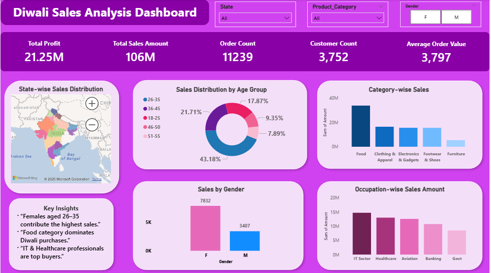

#  Diwali Sales Analysis Project

This project focuses on analyzing Diwali sales data to understand customer behavior, sales trends, and key business insights using Python.  
Later, the same analysis is extended into an interactive dashboard for better visualization and decision-making.

---

##  Project Overview

The dataset contains customer demographics, product categories, order details, and sales amounts during the Diwali festival season.

The objective of this project is to:
- Clean and preprocess raw sales data
- Perform exploratory data analysis (EDA)
- Identify meaningful sales insights
- Convert analytical insights into a visual dashboard

---

##  Tools & Technologies Used

### Python Analysis:
- Python
- Pandas
- NumPy
- Matplotlib
- Seaborn
- Jupyter Notebook

### Dashboard:
- Power BI

---

##  Python Analysis Highlights

- Data cleaning (null values, duplicates, formatting)
- Gender-wise sales analysis
- Age group-wise sales contribution
- State-wise sales performance
- Product category & occupation-based analysis
- KPI calculations:
  - Total Sales
  - Total Orders
  - Customer Count
  - Average Order Value
  - Profit Analysis

---

##  Dashboard Extension (Power BI)

Initially, this project was built entirely in **Python** for analysis and insight generation.  
To improve clarity and storytelling, the same insights were later converted into an **interactive Power BI dashboard**.

### Dashboard Features:
- KPI cards (Sales, Profit, Orders, Customers, AOV)
- State-wise sales map
- Age group distribution (Donut chart)
- Gender-wise comparison
- Category-wise & occupation-wise sales analysis
- Interactive slicers (State, Category, Gender)

---
## Dashboard Preview 

##  Key Insights

- Female customers aged **26–35** contribute the highest sales
- **Food category** dominates Diwali purchases
- **IT & Healthcare professionals** are top buyers
- Certain states show significantly higher festive sales

---

##  Conclusion

This project demonstrates an **end-to-end data analytics workflow** — from raw data cleaning and analysis in Python to visual storytelling through a dashboard.

It helped strengthen my understanding of:
- Business-focused KPIs
- Data visualization principles
- Analytical thinking beyond just code

---
